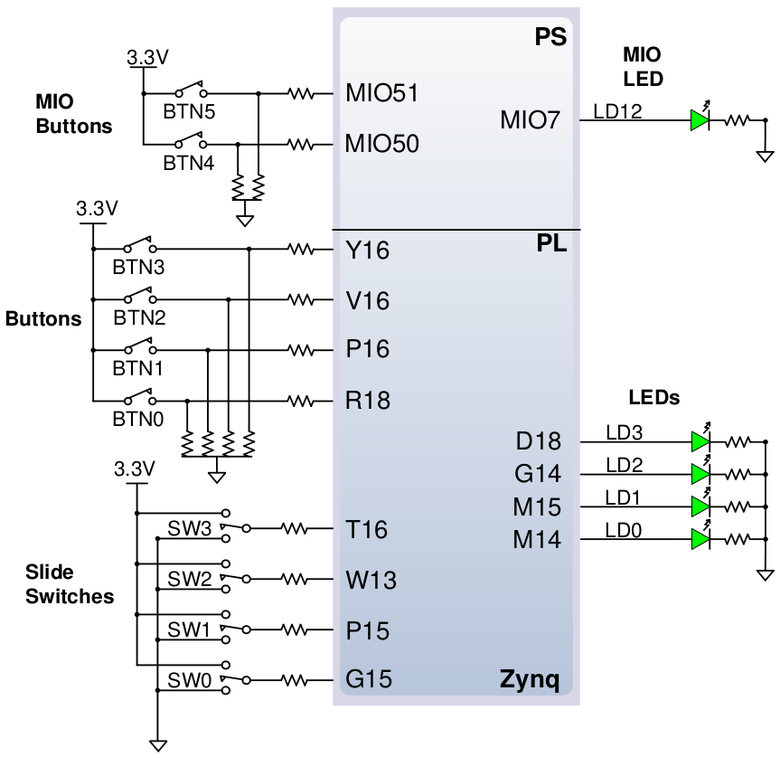
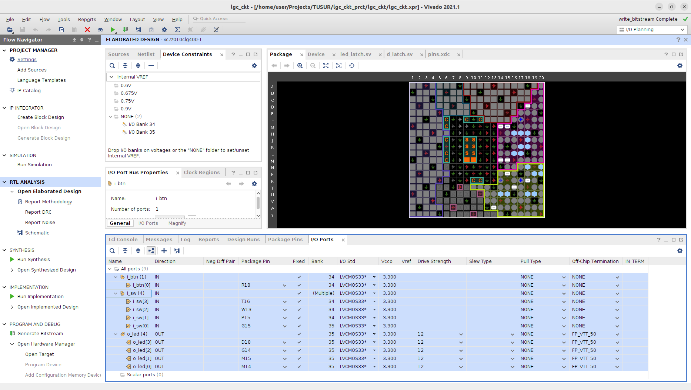

[.text-justify]
= Логические схемы (практика)
:source-highlighter: coderay
:toc:
:toclevels: 4
:sectnums:
:pagenums:
:last-update-label!:
:toc-title: Содержание
:sect-caption: Разд.
:section-refsig: Разд.
:table-caption: Табл.
:figure-caption: Рис.
:chapter-signifier:
:chapter-refsig: Разд.
:xrefstyle: short
:pdf-page-layout: portrait
:doctype: book
// :author: Максим Кулешов
// :email: kuleshov_mv@lemz-t.ru
// :version-label: Версия
// :revdate: 12/12/2025
// :revnumber: 1.0
// :revremark:

== Создание проекта в Vivado

. Создать папку для будущего проекта и скопировать туда файлы из архива.
** Название проекта и путь до папки не должны содержать кириллицы и пробелов.
. Запустить Vivado, выбрать пункт "Create Project" в разделе "Quick Start".

[cols="a", frame=none, grid=none, width=50%, align=center]
|===
|image::../img/01.png[title="Стартовое окно Vivado"]
|===

Открывается окно "New Project".

. *Create a New Vivado Project* -- приветственное окно. +
Кликнуть "Next".

. *Project Name* -- имя проекта. +
Указать имя проекта (например, lgc_ckt) и выбрать ранее созданную папку для его размещения

. *Project Type* -- тип проекта. +
Оставить отметку на радио-кнопке "RTL Project" (register transfer level), снять отметку с чекбокса "Do not specify sources at this time" (потому что у нас есть заранее созданные SV модули).

. *Add Sources* -- добавление SV модулей. +
Кликнуть "Add Files", выбрать файл `smp_ckt.sv` в папке на один уровень выше папки с проектом, затем кликнуть "OK" и "Next".
+
[cols="^.<a, ^.<a", frame=none, grid=none, width=80%, align=center]
|===
|image::../img/02.png[title=Вкладка "Create a New Vivado Project"]
|image::../img/03.png[title=Вкладка "Project Name"]
|image::../img/04.png[title=Вкладка "Project Type"]
|image::../img/05c.png[title=Вкладка "Add Sources"]
|===
+
[cols="a", frame=none, grid=none, width=50%, align=center]
|===
|image::../img/05b.png[title=Всплывающее окно "Add Sources Files"]
|===

. *Add Constraints* -- добавление констрейнтов (как правило, для подключения пинов ПЛИС и указания параметров для временного анализа). +
Создадим заранее файл для подключения портов SV модулей к кнопкам и индикаторам на плате через ножки ПЛИС: кликнуть "Create Files", ввести имя файла (например, "pins"), затем кликнуть "OK" и "Next".

. *Default Part* -- выбор ПЛИС. +
Здесь требуется сделать небольшое отступление: как определить, какую нужно выбрать ПЛИС?
Для этого придётся обратиться к документации на плату.
+
** Как обозначаются ПЛИС, чтобы мы знали, что искать: систему обозначений ПЛИС Xilinx (AMD) можно найти в документах вида "... Product Selection Guide" или "... Overview" для соответствующего семейства ПЛИС, например, "Zynq-7000 SoC Product Selection Guide".
Как следует из рисунка, название должно начинаться с "XC" (Xilinx Commercial).
+
[cols="^.^a, ^.^a", frame=none, grid=none, width=95%, align=center]
|===
|image::../img/06b.png[title=Вкладка "Add Constraints (optional)"]
|image::../img/06a.png[title=Всплыващее окно "Create Constraints File", width=60%, align=center]
|===
+
[cols="a", frame=none, grid=none, width=95%, align=center]
|===
|image::../img/07a.png[title=Система обозначений Zynq 7000]
|===
** ПЛИС будет (как правило) микросхемой с наибольшим количеством пинов на схеме платы , и среди этих пинов обязательно будут:
*** JTAG интерфейс -- TMS, TCK, TDI, TDO;
*** системные пины, отвечающие за процесс включения (boot) ПЛИС -- DONE, PROGRAM, INIT и пр.
** Или можно просто посмотреть название ПЛИС в даташите на плату.
+
Но если мы введём найденное обозначение "XC7Z010-1CLG400C" в строку поиска, то ничего не найдём -- потому что Vivado придерживается несколько иной системы обозначений:
+
--
.. Part Number (Series, Family и Value Index) -- "XC7Z010" (первая группа символов);
.. Single Core Indicator -- отсутствует в этом случае;
.. Package Type (Footprint и Package Pin Count) -- "CLG400";
.. Speed Grade -- "-1".
--
+
Находим необходимую ПЛИС -- "XC7Z010CLG400-1" -- и кликаем "Next".
+
[cols="^.^a, ^.^a", frame=none, grid=none, width=95%, align=center]
|===
|image::../img/07b.png[title=Схема платы Zybo]
|image::../img/07c.png[title=Даташит на плату Zybo]
|===

. *New Project Summary* -- подведение итогов. +
Кликнуть "Finish".
+
[cols="a", frame=none, grid=none, width=50%, align=center]
|===
|image::../img/08.png[title=Вкладка "New Project Summary"]
|===

Открывается окно с только что созданным проектом.
Остаётся только добавить последний заранее созданный файл -- тестбенч `tb_smp_ckt.sv`.

[cols="a", frame=none, grid=none, width=100%, align=center]
|===
|image::../img/09.png[title=Окно проекта в Vivado]
|===

. Выполнить ПКМ во вкладке "Sources" и выбрать "Add Sources..." в ниспадающем списке.
** Или использовать комбинацию горячих клавиш Alt + A.
. *Add Sources* -- выбор между различными видами проектных файлов (констрейнты, синтезируемые модули и тестбенчи). +
В открывшемся окне отметить радио-кнопку "Add or create simulation sources", кликнуть "Next".
. *Add or create simulation sources* -- добавление тестбенчей. +
Кликнуть "Add Files", выбрать файл `tb_smp_ckt.sv` в папке на один уровень выше папки с проектом, затем кликнуть "OK" и "Finish".
// . После непродолжительного обновления иерархии проекта во вкладке "Sources" дерево проекта выглядит следующим образом.

[cols="^.<a, ^.<a", frame=none, grid=none, width=80%, align=center]
|===
|image::../img/10.png[title=Вкладка "Add Sources"]
|image::../img/11c.png[title=Вкладка "Add or create simulation sources"]
|===

[cols="a", frame=none, grid=none, width=50%, align=center]
|===
|image::../img/11b.png[title=Всплывающее окно "Add Source Files"]
|===

И настроим сразу симулятор Vivado Sim.

. Кликнуть "Settings" под разделом "PROJECT MANAGER" на панели "Flow Navigator" слева.
** Это окно так же можно открыть через панель инструментов сверху: "Flow" -> "Settings".
. Перейти в открывшемся окне *Settings* в меню "Simulation" под разделом "Project Settings" на панели слева.
. Открыть вкладку "Simulation" в правой части окна.
** Отметить чекбокс "log_all_signals", чтобы отображать все сигналы проекта.
** Изменить время симуляции ("runtime") на 100 нс для удобства отображения.

[cols="a", frame=none, grid=none, width=40%, align=center]
|===
|image::../img/12.png[title="Окно \"Settings\", вкладка \"Simulation\""]
|===

== Разбор примера

[cols="a", frame=none, grid=none, width=50%, align=center]
|===
|image::../img/16.png[title=Пример схемы]
|===

Разберём логическую схему, приведённую на рисунке выше:

* у неё есть один 4-разрядный вход _D_ и два однобитных выхода _QX_ и _QY_;
* она состоит из логических элементов AND, OR и NOT;
* в ней выделен некий промежуточный сигнал _n1_ на выходе элемента AND;
* схема является комбинационной, так как в ней нет обратной связи или синхронной логики (регистров).

Реализация этой схемы на языке SystemVerilog уже приведена в проекте в модуле *smp_ckt* -- откройте его в Vivado двойным кликом.
Пройдёмся по всем составляющим типичного модуля.

. Все файлы, переменные и константы в HDL языках как правило обозначаются буквами одного регистра (все строчные или все заглавные) в стиле "snake_case" (слова разделяются нижними подчёркиваниями), например:
** проекты, файлы и модули -- *project_1*, *lgc_ckt*, *FIFO*;
*** тестбенчи обычно отмечаются префиксом или суффиксом *tb*;
** константы -- `G_NUM`, `C_WIDTH`  -- все заглавные буквы с префиксами `G` (generic) или `C` (const);
** входные и выходные порты -- `i_clk`, `o_data`, `b_sda`, `s_tvalid`, `m_tuser` -- все строчные буквы с префиксами `i`, `o`, `b`, `s` и `m` (input, output, inout/bidirectional, slave и master соответственно);
** внутренние переменные -- q_cnt, w_sum -- все строчные с префиксами `q` (как выход регистра _Q_, то есть, синхронная логика) и `w` (как wire, то есть, соединения между элементами и комбинационная логика).

. *Объявление SV модуля*
+
[source]
----
module <имя модуля> #(
	<константные параметры модуля (опционально)>
) (
	<входные и выходные порты модуля>
);

<объявление переменных и код, описывающий логику модуля>

endmodule
----

. *Константные параметры (parameter) модуля*
+
[source]
----
<слово "parameter" (только в Verilog)> <тип> <имя> = <значение>
----
Например, `int G_NUM = 4`.
** Параметры могут быть различных типов (bit, int, real и другие).
** Значение параметра может быть переопределено при добавлении копии этого модуля внутри другого модуля (инстанцировании).

. *Внешние порты модуля*
+
[source]
----
<направление> <тип> <разрядность> <имя>
----
+
Например, `input wire i_clk` или `output reg [31:0] o_data = '0`.
+
** Порты могут быть:
*** `input` -- входными,
*** `output` -- выходными (порты типа `output reg` или `output logic` -- единственные, кому можно назначить значение по умолчанию),
*** `inout` -- двунаправленными.
*** интерфейсы (interface) могут содержать как входные, так и выходные порты, упакованные в одну переменную (будут рассмотрены позже).
** Для портов как правило используется двоичные типы данных:
*** `wire` для входов (как бы "провод", соединение),
*** для выходов так же может использоваться `wire`, если логика комбинационная, но для синхронной последовательностной можно использовать типы `logic` или `reg`.
** В SV почти всегда используется little-endian нумерация бит, например, [31:0] -- старший бит слева, младший бит справа.
*** Иногда для портов применяются двумерные упакованные массивы (packed array) -- это, фактически, одномерный вектор, но представленный в виде двумерного (или трёхмерного и так далее) массива для удобства работы с данными.
Например, 32 бита можно разложить на 4 байта по 8 бит как `output wire [3:0][7:0] o_data`.

. *Внутренние переменные модуля* -- записываются аналогично портам (но без направления) или параметрам.
+
[source]
----
<тип> <разрядность> <имя>;
----
+
Например, `wire w_n1;` или `reg [7:0] q_mem [0:3] = '{default: '0'}` (это так называемый неупакованный массив, unpacked array -- пример "подлинных" многомерных массивов).
+
** переменные типа `reg` и `logic` можно инициализировать -- присвоить им значение по умолчанию.
+
[source]
----
int q_cnt = 16;
logic [7:0] q_word = 8'hFA;
----
** переменным типа `wire` можно сразу при объявлении присвоить некоторое логическое выражение с использованием других переменных.
+
[source]
----
wire w_ex_0 = (A && B) || C;
wire w_ex_1 = (sel) ? i_1st : i_2nd;
----

. *Операторы присваивания* -- рассмотрим подробнее на следующих занятиях, здесь очень краткая информация.
** Присваивания бывают двух видов.
*** Неблокирующие (`<=`) -- как правило, последовательностная логика. Применяются только в процедурах *always* (*always_comb*, *always_ff* и так далее).
+
[cols="a, a", frame=none]
|===
|
[source]
----
always_latch
	if (GATE)
		Q <= D; // защёлка
----
|
[source]
----
always_ff @(posedge i_clk)
	Q <= D; // регистр (флип-флоп)
----
|===
*** Блокирующие (`=` ) -- как правило, комбинационная логика (оператор *assign*) или тестбенчи и инициализация (процедуры *initial* и другие).
+
[cols="a, a", frame=none]
|===
|
[source]
----
assign Q = D;
----
|
[source]
----
initial begin
	Q = '0;
	#1;
	Q = '1;
end
----
|===

В Vivado есть встроенный справочник *Language Templates* по синтаксису языков Verilog и VHDL.
Он вызывается нажатием на кнопку с иконкой лампочки в текстовом редакторе или через меню "Tools" -> "Language Templates" на верхней панели.

[cols="a", frame=none, grid=none, width=70%, align=center]
|===
|image::../img/15.png[title=Окно справочника "Language Templates"]
|===

Теперь вернёмся к модулю *smp_ckt*.
В нём используется параметр `G_MODE` для переключения между двумя вариантами реализации -- это сделано только в демонстрационных целях, чтобы показать, как можно включать или выключать отдельные блоки кода с помощью зависящих от констант условных операторов.
Если упростить модуль, то получится следующий код.

[cols="<.^a, ^.^a", frame=none, grid=none, width=100%, align=center]
|===
|
[source]
----
module smp_ckt (
	input  wire [3:0] D,
	output wire       QX, QY
);

wire n1 = D[0] && D[1];

assign
	QX = n1 \|\| D[2],
	QY = !(QX \|\| D[3]);

endmodule: smp_ckt
----
|image::../img/16.png[title=Пример схемы (повтор)]
|===

<<<

=== Элаборация

При выборе пункта "Open Elaborated Design" под разделом "RTL ANALYSIS" во вкладке "Flow Navigator" Vivado проводит синтаксическую проверку проекта и строит его упрощённую логическую схему.
Можно убедиться, что схема модуля *smp_ckt* совпадает с требуемой.

[cols="a", frame=none, grid=none, width=100%, align=center]
|===
|image::../img/13.png[title=Вкладка "Elaborated Design")]
|===

<<<

=== Симуляция

Симуляция нужна, чтобы проверить работоспособность кода проекта до его реализации в "железе" (без записи битстрима в ПЛИС).
Чтобы просимулировать модуль, нужно написать ещё один специальный модуль для отладки -- так называемый тестбенч (testbench).
В тестбенче описываются некие тестовые входные воздействия и, как правило, добавляются автоматические проверки поведения тестируемого модуля.

В рассматриваемом примере тестбенч используется, чтобы построить таблицу истинности разработанной логической схемы.
Откройте тестбенч *tb_smp_ckt* в текстовом редакторе Vivado.
Этот модуль содержит несколько новых конструкций.

. *Инициализация (процедура initial)* -- здесь используется для симуляции входного сигнала.
** *Задержки* -- записываются через решётку (#), измеряются в нс.
+
[cols="<.<a, <.<a", frame=none]
|===
|
[source]
.Переменная Q примет значение 0 через 1 нс
----
#1 Q = '0;
----
|
[source]
.Переменная Q принимает значение 0 немедленно, после чего выдерживается пауза в 1 нс
----
Q = '0;
#1;
----
|===
** *Цикл (for loop)*
+
[source]
----
for (int i = <начальное значение>; i <= <конечное значение>; i<++/-->) begin
	<некий код>
end
----

. *Инстанцирование (instantiation)* -- добавление копии одного модуля внутрь другого модуля.
+
[source]
----
<исходное имя вложенного модуля> #(
	.<имя параметра вложенного модуля> (<имя параметра топ-модуля>)
) <имя копии вложенного модуля> (
	.<имя порта вложенного модуля> (<имя переменной или порта топ-модуля>)
);
----
+
То есть, слева после точки записываются обозначения вложенного модуля, а справа в круглых скобках -- соответствующие им сигналы/константы или задаваемые значения из топ-модуля.
+
** Константам и входным портам можно присваивать константные значения, записываемые числом, например
+
[source]
----
.i_reset (1'b0),
----
** Выходные порты можно оставлять не подключенными ни к каким "полезным" сигналам -- или вообще не объявлять в топ-модуле.
+
[source]
----
.o_done (),
----

Запустите симуляцию через кнопку "Run Simulation" под разделом "SIMULATION" на панели "Flow Navigator" слева.

Пройдёмся по новым вкладкам, слева направо.

* *Scope* -- показывает симулируемые модули.
* *Objects* -- показывает все переменные и константы выбранного в *Scope* модуля.
* *Wave Window* (вкладка с белой сеткой на чёрном фоне, подписанная как "Untitled 1") -- программный осциллограф, показывающий эпюры (временные диаграммы) сигналов.
** Дополнительные вкладки можно добавить через меню "File" -> "Simulation Waveform" -> "New Configuration" на верхней панели инструментов.
** Сигналы можно перетаскивать из *Objects* в *Wave Window* зажатием мыши -- или через ПКМ -> "Add to Wave Window".

[cols="a", frame=none, grid=none, width=100%, align=center]
|===
|image::../img/14.png[title=Вкладка "Simulation"]
|===

== Защёлка (примитив)

=== Топ-модуль: защёлка для управления светодиодами

Модуль должен считывать состояние четырёх DIP-переключателей и отображать их на четырёх светодиодах, но обновление светодиодов происходит только при нажатии кнопки -- в этот момент значения переключателей фиксируются.
На рисунке ниже отмечены элементы, которые нам понадобятся. В порядке расположения сверху вниз и слева направо:

* 4 светодиода (LED) LD0&#8211;LD3 (№8),
* 4 рычажных переключателя (DIP-switch) SW0&#8211;SW3 (№9),
* одна кнопка (push-button) BTN0 (№13).

[cols="a", frame=none, grid=none, width=80%, align=center]
|===
|image::../img/17.png[title=Плата Zybo (Zynq Board)]
|===

Создайте новый синтезируемый модуль (design source) под названием *led_latch*, при этом не забудьте

* установить радиокнопку на первой вкладке всплывающего окна на "Add or create *design* sources",
* указать язык *SystemVerilog* (формат .SV), а не просто Verilog (формат .V) в окне "Create Source File".

Ниже приведён код реализации простой защёлки (D-latch): когда сигнал `i_btn` равен 1, то выход `o_led` принимает значение входа `i_sw`.

[cols="9a, 6a, 8a", frame=none, grid=none]
|===
|[source]
.Код модуля *led_switch*
----
module led_latch (
	input  wire        i_btn,
	input  wire  [3:0] i_sw,
	output logic [3:0] o_led
);

always_latch
	if (i_btn)
		o_led <= i_sw;

endmodule: led_latch
----

|[%header, cols="3*^1"]
.Таблица истинности
!===
!i_btn !i_sw !o_led
!0 !0 !o_led
!0 !1 !o_led
!1 !0 !0
!1 !1 !1
!===

|image::../img/18.png[title=Схема модуля *led_switch*]
|===

=== Констрейнты

Теперь нужно назначить пины для всех входных и выходных сигналов, для чего придётся снова обратиться к даташиту и схеме платы Zybo.
Вообще констрейнты для портов записываются следующим образом:

[source]
----
set_property -dict {PACKAGE_PIN <номер пина> IOSTANDARD <тип пина>} [get_ports {<имя порта>}]
----

Например, `set_property -dict {PACKAGE_PIN R18 IOSTANDARD LVCMOS33} [get_ports {i_btn}]`.
Названия портов нам известны, осталось найти номера пинов и определиться с их типом.

. Номера пинов можно найти в даташите (zybo_rm.pdf, рис.14 на с.22).
+
[cols=".^2a, .^a", frame=none, grid=none]
|===
|

|[%header, cols="2*^1"]
.Пины светодиодов, переключателей и кнопки
!===
!Сигнал !Пин
!BTN0 !R18
!SW3 !T16
!SW2 !W13
!SW1 !P15
!SW0 !G15
!LD3 !D18
!LD2 !G14
!LD1 !M15
!LD0 !M14
!===
|===

. Чтобы найти тип, нам понадобится открыть схему платы (zybo_sch.pdf, cc.10&#8211;11):
** находим поиском название одного из сигналов или пинов,
** смотрим, в каком банке пинов ПЛИС он находится (суффикс обозначения пина со стороны ПЛИС, например, "_34"),
** ищем на схеме напряжение питания этого банка (например, VCCO_34).
+
В нашем случае используются банки 34 и 35, питание обоих банков равно 3,3 В (определяет логические уровни сигналов в этих банках).
Кроме того, мы видим, что эти сигналы не дифференциальные, так что скорее всего их IOSTANDARD равен LVCMOS33 (последние цифры отсылают к логическому уровню).
+
[cols=".>2a, .>3a", frame=none, grid=none]
|===
|image::../img/20a.png[title=Поиск банка пинов]
|image::../img/20b.png[title=Поиск логического уровня банка]
|===

. Откройте файл *pins.xdc* из раздела "Constraints" архитектуры проекта и запишите туда констрейнты всех портов по приведённому ниже образцу.
+
[sources]
. Пример констрейнтов из *pins.xdc*
----
set_property -dict {PACKAGE_PIN R18 IOSTANDARD LVCMOS33} [get_ports {i_btn}]
set_property -dict {PACKAGE_PIN G15 IOSTANDARD LVCMOS33} [get_ports {i_sw[0]}]
<...>
set_property -dict {PACKAGE_PIN G14 IOSTANDARD LVCMOS33} [get_ports {o_led[2]}]
set_property -dict {PACKAGE_PIN D18 IOSTANDARD LVCMOS33} [get_ports {o_led[3]}]
----

. Чтобы дополнительно проверить себя, мы можем посмотреть Elaborated Design проекта:
** сделать *led_latch* топ-модулем проекта -- ПКМ по модулю -> "Set as Top";
** открыть "Open Elaborated Design" на панели слева;
** переключиться на вкладку "I/O Planning" в правом верхнем углу;
** теперь здесь можно посмотреть какие пины были назначены для каждого пина, и в каком банке ПЛИС находятся эти пины.

=== Битстрим

Когда всё готово, то есть

* модуль *led_switch* заполнен и отмечен как топ-модуль проекта,
* констрейнты портов модуля *led_switch* записаны в файл *pins.xdc*,

можно запускать сборку битстрима для конфигурации ПЛИС на плате -- для этого нужно нажать кнопку "Generate Bitstream" на верхней панели или выбрать меню "Flow" -> "Generate Bitstream" там же.

Сборка занимает примерно пару минут, после чего мы столкнёмся со следующей ошибкой:

----
[Place 30-574] Poor placement for routing between an IO pin and BUFG. If this sub optimal condition is acceptable for this design, you may use the CLOCK_DEDICATED_ROUTE constraint in the .xdc file to demote this message to a WARNING. However, the use of this override is highly discouraged. These examples can be used directly in the .xdc file to override this clock rule.
	< set_property CLOCK_DEDICATED_ROUTE FALSE [get_nets i_btn_IBUF[0]] >

	i_btn_IBUF[0]_inst (IBUF.O) is locked to IOB_X0Y9
	 and i_btn_IBUF_BUFG[0]_inst (BUFG.I) is provisionally placed by clockplacer on BUFGCTRL_X0Y0
----

[cols=".>a, .>3a", frame=none, grid=none]
|===
|image::../img/21a.png[title=Уведомление об ошибке]
|image::../img/21b.png[title=Сообщение об ошибке]
|===

Она вызвана тем, что к сигналу разрешения _GATE_ D-защёлки предъявляются те же требования, что к тактовому сигналу (clock), а мы выбрали пин, который не является "clock-capable" (обычно отмечается "\_cc_" в названии), что логично, так как это обычная кнопка.
Здесь мы можем пренебречь этой ошибкой и последовать рекомендации, содержащейся в тексте самой ошибки:

* откройте файл *pins.xdc*,
* добавьте в него строчку `set_property CLOCK_DEDICATED_ROUTE FALSE [get_nets i_btn*]` и сохраните изменения,
* таким образом мы разрешаем использовать выбранный для сигнала `i_btn` пин в качестве сигнала _GATE_ D-защёлки.

Снова запустите генерацию битстрима -- на этот раз проект должен собраться без ошибок, и в конце вы увидите следующее окно.

[cols="a", frame=none, grid=none, width=70%, align=center]
|===
|image::../img/22.png[title=Уведомление об успешной сборке битстрима, width=50%, align=center]
|===

. Сперва проверим, что проект собрался именно так, как мы рассчитывали.
** Выберите "Open Implemented Design".
** Если схема проекта не открывается по умолчанию, её можно открыть, отметив топ-модуль *led_latch* во вкладке "Netlist" и нажав F4.
** Как мы видим, схема полностью совпадает с требуемой -- были сгенерированы 4 защёлки, все сигналы назначены корректно.
+
[cols="a", frame=none, grid=none]
|===
|image::../img/24.png[title=Имплементация модуля *led_latch*]
|===

. После этого можно протестировать его на плате.
** Включайте питание платы, подключайтесь к ней USB-кабелем и открывайте "Hardware Manager" в Vivado.
** Нажимайте кнопку авто-коннект, убедитесь, что устройства определяются как показано на рисунке ниже.
** Отмечайте ПЛИС (устройство xc7z010_1) и через ПКМ выбирайте "Program Device".
** Во всплывающем окне выбирайте только что созданный битстрим (он подставляется автоматически) и нажимайте "OK".
** После завершения записи битстрима на плате должен загореться зелёный индикатор "DONE" (LD10), можно приступать к проверке.

[cols=".>2a, .>3a", frame=none, grid=none]
|===
|image::../img/23a.png[title=Вкладка "Hardware Manager"]
|image::../img/23b.png[title=Окно "Program Device"]
|===

_Какие действия вы предлагаете предпринять, чтобы убедиться, что битстрим работает корректно?_

== Защёлка (пользовательская)

Теперь реализуем то же самое, но в этот раз не будем пользоваться примитивом, а опишем D-защёлку самостоятельно -- так, как это показано в учебной литературе.

=== RS-триггер

. Создайте новый синтезируемый модуль (design source) под названием *rs_trig*.
** Не забудьте при создании указать язык SystemVerilog (формат .SV), а не просто Verilog (формат .V)!
. Реализуйте внутри этого модуля следующую схему.

[cols="a", frame=none, grid=none, width=50%, align=center]
|===
|image::../img/25.png[title=RS-триггер]
|===

=== D-защёлка

Теперь аналогичным образом реализуйте схему D-защёлки в модуле *d_latch* -- используйте при этом инстанцирование модуля *rs_trig* внутри *d_latch*. За примером инстанцирования можете обратиться к ТБ *tb_smp_ckt*.

[cols="a", frame=none, grid=none, width=50%, align=center]
|===
|image::../img/26.png[title=D-защёлка]
|===

=== Топ-модуль

Топ-модуль остаётся тем же -- *led_switch* -- но в него необходимо внести изменения.

. Удалите или закомментируйте фрагмент кода с процедурой *always_latch*.
. Добавьте вместо неё свой новый модуль *d_latch* как вектор длиной 4 с размерностью [3:0] как показано ниже.
+
[source]
.Обновлённый модуль *led_latch*
----
module led_latch (
	input  wire        i_btn,
	input  wire  [3:0] i_sw ,
	output logic [3:0] o_led
);

d_latch u_latch [3:0] (
	.GATE (i_btn),
	.D    (i_sw ),
	.Q    (o_led)
);

endmodule: led_latch
----
+
Это приведёт к тому, что будут вставлены сразу 4 копии модуля *d_latch*, и этим копиям автоматически будут назначены соответствующие биты сигналов `i_sw` и `o_led`.
Сигнал `i_btn` разветвляется на все 4 защёлки как и в предыдущей реализации.

=== Битстрим

Когда всё готово, запускайте сборку битстрима.
Здесь мы снова столкнёмся с ошибкой, но уже другой:

----
[DRC LUTLP-1] Combinatorial Loop Alert: 1 LUT cells form a combinatorial loop. This can create a race condition. Timing analysis may not be accurate. The preferred resolution is to modify the design to remove combinatorial logic loops. If the loop is known and understood, this DRC can be bypassed by acknowledging the condition and setting the following XDC constraint on any one of the nets in the loop: 'set_property ALLOW_COMBINATORIAL_LOOPS TRUE [get_nets <myHier/myNet>]'. One net in the loop is o_led_OBUF[0]. Please evaluate your design. The cells in the loop are: o_led_OBUF[0]_inst_i_1.
----

Ошибка вызвана тем, что петли обратной связи в комбинационной логике могут привести к гонке (race condition) и непредсказуемому поведению цепи.

[cols="a", frame=none, grid=none]
|===
|image::../img/27.png[title=Уведомление об ошибке из-за наличия петли обратной связи в комбинационной логике]
|===

В этом случае мы готовы взять на себя ответственность за такую реализацию, так что снова воспользуемся советом из текста ошибки для отключения этого предупреждения -- разрешим обратную связь в комбинационной логике для всех соединений в наших модулях, для чего в *pins.xdc* нужно добавить следующую строку.

[source]
----
set_property ALLOW_COMBINATORIAL_LOOPS TRUE [get_nets *]
----

Повторим сборку битстрима -- на этот раз он должен собраться без ошибок.
Так же как и прошлый раз, сперва посмотрим имплементацию, а потом прошьём битстрим в ПЛИС (поведение прошивки в ПЛИС должно быть точно таким же).

[cols="a", frame=none, grid=none]
|===
|image::../img/28.png[title="Вкладка \"Implemented Design\" обновлённого модуля *led_latch*"]
|===

== Если остаётся время

* Написать тестбенч для проверки модуля *led_latch*.
* Попробовать собрать то же самое, но в Block Design.
* Реализовать управление светодиодами через GPIO и JTAG-to-AXI в Block Design.
* Разобрать временной анализ в Vivado на примере какого-нибудь несложного модуля с синхронной последовательностной логикой.
